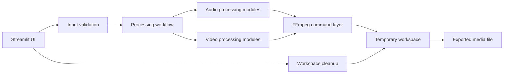

# Remaster+Loop — Media Processing Tool

**Remaster+Loop** is a local Streamlit application for preparing audio and video content through reusable FFmpeg-based workflows.

The tool brings common post-production tasks into one interface: audio trimming, automatic silence removal, loudness preparation, track merging, crossfades, looping, video merging, clip creation from audio and a background image or video, and Spotify Canvas export.

> **Repository status:** this public repository contains the working application source code. Large media files, private materials, temporary outputs, and environment-specific files are intentionally excluded.


## The problem

Preparing music and video content often requires the same sequence of repetitive operations:

- trim the beginning or end of a track;
- remove unwanted silence;
- prepare a seamless loop;
- merge several audio files;
- create smooth transitions with crossfades;
- combine audio with a background image or video;
- merge video fragments;
- export a publication-ready result.

These tasks are commonly spread across separate applications or repeated manually through command-line tools. Remaster+Loop combines them into one guided local workflow.

## Core capabilities

- audio file upload and validation;
- automatic silence trimming;
- time-based audio trimming;
- loudness and mastering workflows;
- track merging;
- configurable crossfades;
- seamless audio looping;
- video-fragment merging;
- video creation from audio and a background image or video;
- vertical Spotify Canvas preparation;
- temporary-workspace cleanup;
- export of processed results;
- Windows setup and run scripts;
- built-in user guide.

## Application modules

The Streamlit sidebar exposes separate workflows:

1. **Mastering**  
   Prepare an audio file using configurable processing presets.

2. **Track Merge**  
   Join several audio files and configure transitions between them.

3. **Video Merge**  
   Concatenate multiple video fragments into one result.

4. **Create Video Clip**  
   Combine audio with a still image or background video.

5. **Looping**  
   Build a repeated or seamless audio version.

6. **Spotify Canvas**  
   Prepare short vertical 9:16 media for Spotify Canvas.

7. **Workspace Cleanup**  
   Remove temporary processing files safely.

8. **User Guide**  
   Open instructions directly from the application.

## Architecture



### UI layer

`app.py` is the Streamlit entry point. It builds the application navigation and routes the user to specialized pages in `ui/pages`.

### Processing layer

The `core` package contains separate audio and video workflows, including mastering, track concatenation, looping, Canvas preparation, video merging, and rendering.

### FFmpeg layer

Media operations are executed through reusable FFmpeg helpers rather than being embedded directly into page code.

### Job and state layer

The `jobs` package and Streamlit session state keep processing parameters and workflow state separate from the UI.

### Workspace and export layer

Temporary input and output files are handled through project path utilities. The cleanup page provides a controlled way to remove working files.

## Main workflow

1. The user opens the local Streamlit application.
2. A processing module is selected from the sidebar.
3. The user uploads audio, video, or an image.
4. The application validates the selected files and parameters.
5. The requested Python and FFmpeg workflow runs locally.
6. The result is saved to the working directory.
7. The user downloads or reuses the exported file.
8. Temporary files can be removed from the cleanup module.

## Screenshots

### Audio mastering


The mastering page provides a guided workflow for preparing an audio track and exporting the processed result.

### Track merging


Multiple tracks can be arranged and combined into one output with transition settings.

### Video merging


The video workflow joins several fragments into one continuous file.

### Video clip creation


Audio can be combined with a background image or video to create a publication-ready clip.

### Spotify Canvas


The Canvas workflow prepares short vertical media in a 9:16 format.

## Tech stack

- Python
- Streamlit
- FFmpeg
- NumPy
- python-dotenv
- local file processing
- media workflow automation
- Windows batch scripts

## Repository structure

```text
remaster-loop-media-tool/
├── .streamlit/
├── assets/
│   ├── mastering.jpg
│   ├── spotify-canvas.jpg
│   ├── track-merge.jpg
│   ├── user-guide.docx
│   ├── video-clip-creation.jpg
│   └── video-merge.jpg
├── core/
│   ├── audio/
│   ├── video/
│   ├── audio_loop.py
│   ├── canvas_tools.py
│   ├── concat_tracks.py
│   ├── concat_videos.py
│   ├── ffmpeg.py
│   ├── mastering.py
│   ├── mastering_presets.py
│   ├── paths.py
│   ├── presets.py
│   ├── utils.py
│   └── video_render.py
├── jobs/
├── ui/
├── app.py
├── requirements.txt
├── RUN_APP.bat
└── SETUP_FIRST_RUN.bat
```

## Local setup

### Windows quick start

For the first launch, run:

```text
SETUP_FIRST_RUN.bat
```

For later launches:

```text
RUN_APP.bat
```

### Manual setup

Create and activate a virtual environment:

```bash
python -m venv .venv
```

Install Python dependencies:

```bash
pip install -r requirements.txt
```

Make sure FFmpeg is installed and available in the system `PATH`.

Start the application:

```bash
streamlit run app.py
```

## User guide

A detailed Russian-language user guide is included in the repository:

[Download the user guide](assets/user-guide.docx)

## My role

I designed and implemented the application workflow, including:

- product logic and module separation;
- Streamlit navigation and user scenarios;
- audio-processing pipelines;
- video-processing pipelines;
- FFmpeg integration;
- temporary-file handling;
- processing presets;
- export workflows;
- validation and user-facing error handling;
- Windows setup and launch automation.

## Publication safety

The public repository does not include:

- API keys or credentials;
- `.env` files;
- private source media;
- copyrighted audio and video materials;
- large working media files;
- temporary processing results;
- local caches and environment folders.

## Project status

The application is a working local portfolio project. Its source code is published to demonstrate practical Python development, FFmpeg integration, file-processing workflows, UI organization, and media automation.

## What this project demonstrates

- building a practical local Python application;
- separating interface code from processing logic;
- automating repeatable audio and video workflows;
- integrating FFmpeg into a user-facing tool;
- handling uploaded files and temporary outputs;
- creating modular processing pipelines;
- preparing software for non-technical Windows users.
