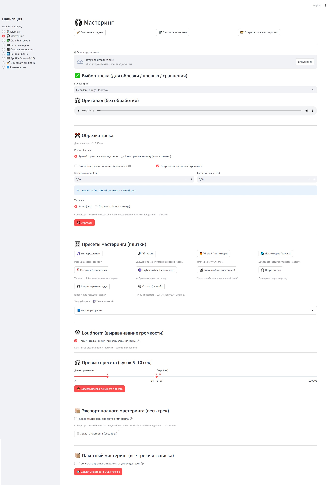
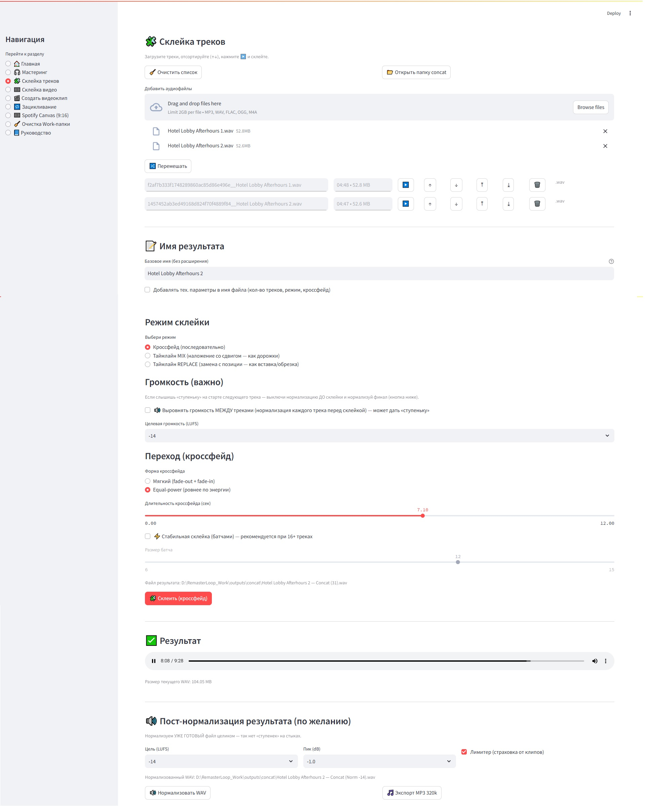
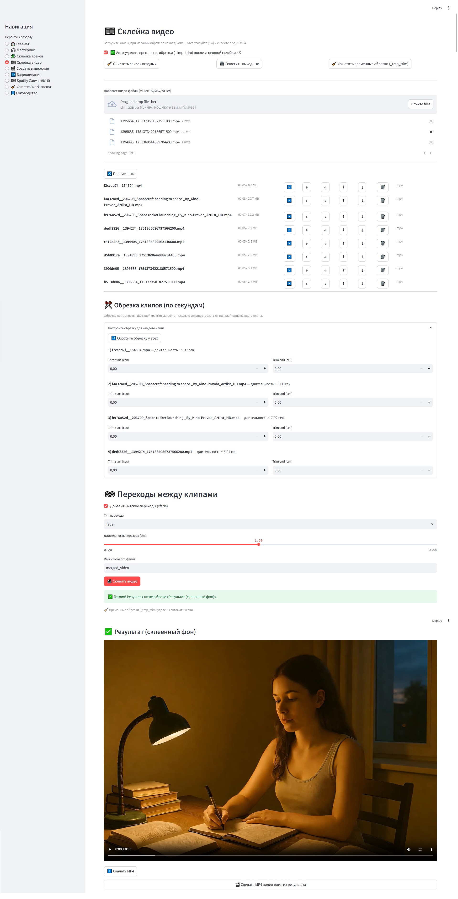
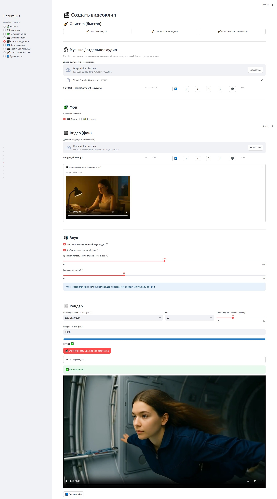
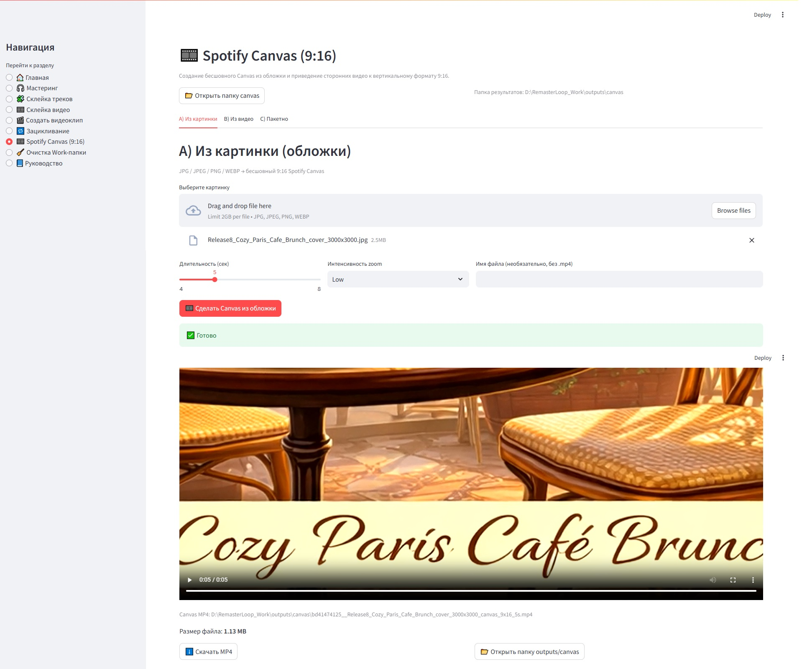

# Remaster+Loop — Media Processing Tool

## О проекте

Remaster+Loop — веб-приложение для подготовки аудио- и видеоконтента.

Проект автоматизирует типовые задачи постобработки: обрезку аудио, авто-срез тишины, нормализацию, склейку треков, кроссфейды, зацикливание аудио, склейку видеофрагментов и подготовку готовых клипов на основе аудио, фонового видео или изображений.

## Какую задачу решает

При подготовке музыкального и видеоконтента часто приходится выполнять повторяющиеся операции:

- обрезать начало и конец трека;
- убрать тишину;
- подготовить loop-версию;
- склеить несколько аудиофрагментов;
- сделать плавный переход через crossfade;
- объединить аудио с фоновым видео или изображением;
- быстро получить готовый файл для публикации.

Remaster+Loop объединяет эти операции в одном инструменте.

## Основные функции

- загрузка аудио;
- загрузка видео или изображения;
- авто-срез тишины;
- обрезка аудио по времени;
- нормализация громкости;
- склейка нескольких треков;
- crossfade между фрагментами;
- зацикливание аудио;
- создание видео на основе аудио и фонового изображения;
- склейка видеофрагментов;
- экспорт готового результата.

## Что сделано 

- проектирование логики приложения;
- backend для обработки файлов;
- маршруты загрузки и обработки медиа;
- пайплайн аудиообработки;
- пайплайн видеосборки;
- работа с временными файлами;
- подготовка структуры проекта;
- интерфейсные сценарии пользователя;
- обработка ошибок при загрузке и экспорте файлов.

## Стек

- Python
- FastAPI / Flask
- FFmpeg
- MoviePy / Pydub
- HTML / CSS / JavaScript
- file processing
- media automation

## Архитектура

Проект можно разделить на несколько слоёв:

1. Web UI  
   Интерфейс загрузки файлов, выбора режима обработки и запуска операции.

2. Backend API  
   Приём файлов, валидация параметров, запуск нужного сценария обработки.

3. Audio processing layer  
   Обрезка, нормализация, удаление тишины, crossfade, loop.

4. Video processing layer  
   Склейка видео, добавление аудио, подготовка клипа.

5. Export layer  
   Сохранение результата и выдача готового файла пользователю.

## Основной workflow

1. Пользователь загружает аудио, видео или изображение.
2. Выбирает нужный режим обработки.
3. Backend сохраняет временные файлы.
4. Сервис обработки запускает FFmpeg / Python pipeline.
5. Создаётся итоговый файл.
6. Пользователь скачивает результат.

## Скриншоты

### Мастеринг

### Склейка треков

### Склейка видео

### Создание видеоклипа

### Spotify Canvas

## Руководство

[Скачать руководство пользователя](assets/user-guide.docx)

## Безопасность публикации

В репозиторий не добавлены:

- приватные файлы;
- ключи;
- `.env`;
- большие медиафайлы;
- чужие аудио- и видеоматериалы;
- временные результаты обработки.

## Статус

Рабочий pet-проект / portfolio project. Код опубликован для демонстрации backend-логики, обработки файлов и прикладной автоматизации.