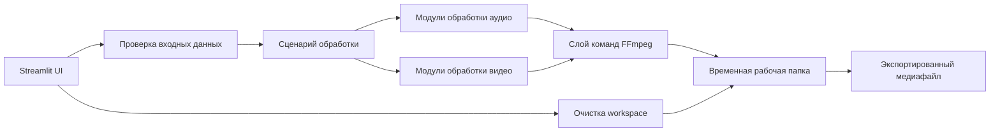

# Remaster+Loop — Media Processing Tool

**Remaster+Loop** — локальное Streamlit-приложение для подготовки аудио- и видеоконтента с помощью повторно используемых FFmpeg-пайплайнов.

Инструмент объединяет в одном интерфейсе типовые задачи постобработки: обрезку аудио, автоматическое удаление тишины, подготовку громкости, склейку треков, кроссфейды, зацикливание, склейку видео, создание клипа из аудио и фонового изображения или видео, а также экспорт Spotify Canvas.

> **Статус репозитория:** в публичном репозитории опубликован рабочий исходный код приложения. Большие медиафайлы, приватные материалы, временные результаты и файлы локального окружения намеренно исключены.


## Какую задачу решает

При подготовке музыкального и видеоконтента часто приходится повторять одни и те же операции:

- обрезать начало или конец трека;
- убрать нежелательную тишину;
- подготовить бесшовную loop-версию;
- склеить несколько аудиофайлов;
- создать плавные переходы через crossfade;
- объединить аудио с фоновым изображением или видео;
- склеить видеофрагменты;
- экспортировать готовый файл для публикации.

Обычно эти задачи распределены между несколькими программами или выполняются вручную через командную строку. Remaster+Loop собирает их в одном локальном рабочем процессе.

## Основные возможности

- загрузка и проверка аудиофайлов;
- автоматическое удаление тишины;
- обрезка аудио по времени;
- мастеринг и подготовка громкости;
- склейка нескольких треков;
- настраиваемые кроссфейды;
- зацикливание аудио;
- склейка видеофрагментов;
- создание видео из аудио и изображения или фонового видео;
- подготовка вертикального Spotify Canvas;
- очистка временной рабочей папки;
- экспорт обработанных файлов;
- Windows-скрипты для установки и запуска;
- встроенное руководство пользователя.

## Модули приложения

В боковом меню Streamlit доступны отдельные рабочие сценарии:

1. **Мастеринг**  
   Подготовка аудиофайла с использованием настраиваемых пресетов.

2. **Склейка треков**  
   Объединение нескольких аудиофайлов и настройка переходов.

3. **Склейка видео**  
   Объединение нескольких видеофрагментов в один файл.

4. **Создать видеоклип**  
   Соединение аудио с изображением или фоновым видео.

5. **Зацикливание**  
   Создание повторяющейся или бесшовной аудиоверсии.

6. **Spotify Canvas**  
   Подготовка короткого вертикального медиа в формате 9:16.

7. **Очистка Work-папки**  
   Контролируемое удаление временных файлов.

8. **Руководство**  
   Просмотр инструкции непосредственно из приложения.

## Архитектура



### UI-слой

`app.py` является точкой входа Streamlit. Он создаёт навигацию и направляет пользователя на специализированные страницы из `ui/pages`.

### Слой обработки

Пакет `core` содержит отдельные аудио- и видеопайплайны: мастеринг, склейку треков, зацикливание, подготовку Canvas, склейку видео и рендеринг.

### FFmpeg-слой

Медиаоперации запускаются через переиспользуемые FFmpeg-хелперы, а не встраиваются напрямую в код интерфейса.

### Состояние и задания

Пакет `jobs` и состояние сессии Streamlit отделяют параметры обработки и состояние сценариев от UI.

### Рабочая папка и экспорт

Временные входные и выходные файлы управляются через утилиты путей проекта. Отдельная страница позволяет безопасно очищать рабочие файлы.

## Основной workflow

1. Пользователь запускает локальное Streamlit-приложение.
2. Выбирает модуль обработки в боковом меню.
3. Загружает аудио, видео или изображение.
4. Приложение проверяет файлы и параметры.
5. Запускается выбранный Python/FFmpeg-пайплайн.
6. Результат сохраняется в рабочую папку.
7. Пользователь скачивает или повторно использует готовый файл.
8. Временные данные можно удалить через модуль очистки.

## Скриншоты

### Мастеринг аудио


### Склейка треков


### Склейка видео


### Создание видеоклипа


### Spotify Canvas


## Технологии

- Python
- Streamlit
- FFmpeg
- NumPy
- python-dotenv
- локальная обработка файлов
- автоматизация медиапайплайнов
- Windows batch scripts

## Структура репозитория

```text
remaster-loop-media-tool/
├── .streamlit/
├── assets/
├── core/
│   ├── audio/
│   ├── video/
│   ├── audio_loop.py
│   ├── canvas_tools.py
│   ├── concat_tracks.py
│   ├── concat_videos.py
│   ├── ffmpeg.py
│   ├── mastering.py
│   ├── mastering_presets.py
│   ├── paths.py
│   ├── presets.py
│   ├── utils.py
│   └── video_render.py
├── jobs/
├── ui/
├── app.py
├── requirements.txt
├── RUN_APP.bat
└── SETUP_FIRST_RUN.bat
```

## Локальный запуск

### Быстрый запуск в Windows

Для первого запуска:

```text
SETUP_FIRST_RUN.bat
```

Для последующих запусков:

```text
RUN_APP.bat
```

### Ручная установка

Создайте виртуальное окружение:

```bash
python -m venv .venv
```

Установите зависимости:

```bash
pip install -r requirements.txt
```

Убедитесь, что FFmpeg установлен и доступен через системный `PATH`.

Запустите приложение:

```bash
streamlit run app.py
```

## Руководство пользователя

[Скачать руководство пользователя](assets/user-guide.docx)

## Моя роль

Я спроектировал и реализовал:

- логику продукта и разделение модулей;
- навигацию Streamlit и пользовательские сценарии;
- пайплайны обработки аудио;
- пайплайны обработки видео;
- интеграцию с FFmpeg;
- работу с временными файлами;
- пресеты обработки;
- сценарии экспорта;
- проверку параметров и сообщения об ошибках;
- автоматизацию установки и запуска в Windows.

## Безопасность публикации

В публичный репозиторий не добавлены:

- API-ключи и учётные данные;
- `.env`;
- приватные исходные медиа;
- чужие аудио- и видеоматериалы;
- большие рабочие медиафайлы;
- временные результаты обработки;
- локальные кеши и папки окружения.

## Статус проекта

Это рабочий локальный portfolio project. Исходный код опубликован для демонстрации практической Python-разработки, интеграции FFmpeg, обработки файлов, организации интерфейса и автоматизации медиапайплайнов.
